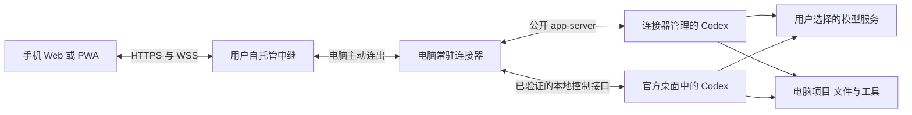

# Codex Mobile Web 设计方案

状态：0.1 实现已落地，文中范围仍包含待验收及后续补齐项。更新日期：2026-09-06。产品范围见 [项目说明](README.md)，开发顺序见 [实施计划](IMPLEMENTATION.md)。

下文是本项目的设计选择，不代表候选项目已实现，也不代表已通过稳定性验证。公开接口、私有桌面接口和手机行为均以实施时固定的版本为准。

## 1 界面与使用流程

本轮以用户提供的三张 Codex 移动端截图作为 UX 参考。使用白色底、黑色主操作、浅灰用户气泡和统一线性图标，不绘制手机系统状态栏。

首页为 Remote：顶部显示电脑连接状态，正文先列项目，再列最近会话；会话标题保持单行，右侧显示相对时间。底部悬浮搜索和新聊天入口。项目来源为已接入根目录及已发现的会话目录，搜索交由电脑的原生会话索引处理，保留分页。

打开会话后显示圆形返回按钮、标题/项目/电脑组成的胶囊，以及电脑和更多菜单。手机一次只呈现一个主要页面；宽屏保留列表与会话双栏。页内返回与浏览器返回恢复上一层，不把返回当成停止。

新聊天先显示居中的“我们来处理”和项目选择，点击发送时才创建会话并提交首条消息。创建和发送分别有稳定操作 ID；创建结果不明时不发送下一步，首条消息回执丢失也不重发。创建已确认但消息未能发出时保留文字草稿；图片只在内存，丢失后明确提示重新选择。

输入区改为底部悬浮胶囊：左侧加号打开图片、模型与文件等选项；空白时显示键盘听写入口，有文字时显示发送箭头。当前任务运行时单独保留停止按钮，并提示可以补充。模型和推理档位放进底部菜单；只做当前底模具备的图片能力，不展示无效上传入口。

命令活动默认折叠，助手回复直接排版。会话加载期间显示骨架占位，空会话显示新聊天布局。任务状态、待回应请求与发送错误只在相关时出现。读取更早内容时保留阅读位置，文件预览关闭后回到原会话。输入框随内容扩展，并根据可视窗口调整高度以适应软键盘；这些手机行为仍需人工实测。

语音使用系统键盘听写。网页麦克风图标会聚焦输入框并提示使用键盘麦克风，不启动网页录音或实时语音服务。应用内语音对话不在本轮范围。菜单采用底部面板，支持焦点限制、关闭按钮和 Escape。

## 2 系统结构

图中的两个 Codex 入口表示会话可能来自不同运行环境；一个正在运行的会话只通过其真实控制路径执行写操作。不得为同一活动会话另启一个运行实例来冒充接管。

| 组件 | 职责 | 保存的状态 |
| --- | --- | --- |
| Web | 展示、输入、审批、文件预览 | 中继连接信息、按中继与机器及会话区分的草稿、最后接收位置 |
| 中继 | 校验连接 Token、路由连接 | 地址与 Token 配置、必要运行日志；在线路由保存在内存 |
| 连接器 | 对接本机 Codex、控制操作、恢复与按需读文件 | 连接配置、操作记录、有限事件缓存、当前请求映射 |
| Codex | 真正执行任务、管理上下文、工具与审批 | 原生会话、运行状态、项目配置与模型认证 |

中继不保存聊天历史、文件内容或模型凭据，也不代理模型推理；转发过程中的内存缓冲不作业务数据持久化。不需要为中继建立账号或会话数据库。电脑离线时，Web 显示离线及缓存的最后状态，不能将旧状态显示为实时结果。

## 3 实现底座与平台

已固定提交检查 Codex Anywhere。其认证、配对、浏览器控制与执行主链路耦合较深，原桌面工具路径不足以覆盖原生审批，因此选择小型独立实现，具体证据见 SOURCES.md。[来源](https://github.com/gaotong132/codex-anywhere)

实现使用 TypeScript、React、Vite、Node.js 与 WebSocket；依赖由 package-lock.json 固定。连接器使用 Node 内置 SQLite 保存最小操作记录，不引入额外数据库服务。

公开 app-server 承接连接器管理的任务；桌面控制代码限制在独立小模块内，不散落到 UI 和中继。Remodex 可作为桌面 IPC 参考，其文档明确说明该协议为私有协议，升级可能要求同步适配。[来源](https://github.com/Emanuele-web04/remodex#codex-desktop-app-integration)

Windows 先验证本机 CLI、路径、权限、服务环境与桌面控制。普通用户安装包应携带连接器所需运行时；检测到可用 Codex 时复用，不替换已有可执行文件。macOS 共享业务与 Web 代码，仅启动、凭据存储、路径和本地 IPC 等系统差异单独适配。

若 Windows 关键接口不可用，按实施计划转到 macOS 验证同一场景。平台调整不能省略当前任务控制与审批要求。

## 4 模型与本机配置

Codex 官方支持自定义模型提供商，端点、认证及模型目录属于原生配置能力。[官方配置文档](https://learn.chatgpt.com/docs/config-file/config-advanced#custom-model-providers)

DeepSeek 已提供 Responses API 与 Codex 接入说明，可作为第三方模型首验对象。不同模型支持的图片、推理和工具能力仍有差异，不能由“兼容 API”推导为所有能力相同。[接入说明](https://api-docs.deepseek.com/quick_start/agent_integrations/codex/)、[兼容范围](https://api-docs.deepseek.com/zh-cn/guides/responses_api/)

连接器按以下方式接入：

1. 识别实际 Codex 可执行文件、版本、操作系统用户、配置目录和用户选择的配置方案。
2. 让目标 Codex 解析用户与项目配置。优先读取其有效配置和当前会话返回值，避免自建一套 TOML 合并规则。
3. 沿用模型、端点、凭据来源、模型目录、代理、MCP 与 skills；向 Web 只返回展示所需的非敏感字段。
4. 连接器后台启动时核对必要环境变量是否可用。缺失时提示在电脑修复，不把模型 Key 发送到手机或中继。
5. 新建任务使用选定项目的有效默认值；继续会话保留该会话模型与配置。明确的用户选择才能覆盖默认值。
6. 模型目录不可用时保留当前模型和手工填写模型 ID 的入口；不静默选择 OpenAI 模型，不自动切换 provider。

中继不维护一套额外的 Codex 权限策略。已有会话沿用原权限；用户已配置的完全访问模式可直接使用。连接器新建任务同样优先沿用用户配置，可提供运行端支持的访问模式选项，不逐工具加白名单或反复确认。运行端实际发出的审批仍正常透传和响应。

首版以继承已有配置为主，模型选择发生在同一已配置提供商内。跨提供商配置向导与一键配置 DeepSeek 属于后续易用性增强，不阻塞已配置用户使用。

列出历史时核对提供商、来源和归档过滤条件，避免将过滤导致的不可见误报成会话丢失。不同配置下的同名项目或会话不得靠标题合并。

## 5 会话控制

连接器内部保存机器、会话、当前任务与真实控制路径的关联。UI 使用项目名与会话名，不展示内部归属术语。

公开 app-server 已定义 `turn/start`、`turn/steer`、`turn/interrupt` 以及服务端审批请求；私有桌面路径需要在 P0 对照当前版本逐项确认。[官方接口文档](https://learn.chatgpt.com/docs/app-server)

| 动作 | 执行规则 |
| --- | --- |
| 打开会话 | 读取历史并订阅当前运行状态；不启动新任务，不中断 |
| 空闲时发送 | 通过该会话的控制路径开始新一轮 |
| 运行中发送 | 使用带目标任务校验的补充接口；仅原生排队可用时保留其语义，不自建隐式队列 |
| 停止 | 指向用户看到的当前任务；收到中断完成事件后收敛状态 |
| 审批和回答 | 回写原始请求对应的连接与请求 ID，保留实际选项、字段和授权范围 |

任务可能在点击发送与到达电脑之间结束。遇到目标变化，返回当前状态，保留输入，让用户决定是否作为下一轮发送；不静默重定向到另一任务。

一条写操作由运行端的当前状态校验和单次有效决策收敛。电脑与手机同时审批时，一端处理后另一端显示“已处理”。请求失效、运行连接更换或任务结束时，旧审批按钮失效；不能把旧 ID 复用到新请求。

命令审批、文件审批、权限请求、MCP 问询和普通用户问题按实际类型展示。未知请求类型显示明确的暂不支持状态，在实现前不得声称所有审批已覆盖。

## 6 发送确认与恢复

每个用户操作生成稳定操作 ID，并带中继实例、机器、会话和目标任务标识。同一操作重连重试时保持 ID；新的用户动作使用新 ID。

连接器在转发前持久化最小操作记录：操作 ID、目标、操作类型、载荷摘要、发送状态及已有运行端回执。数据库不需要复制聊天内容，也不承担权限审计。

| 操作状态 | 含义及处理 |
| --- | --- |
| 已接收 | 电脑收到并记下操作，不代表 Codex 已接受 |
| 发送中 | 正在提交到运行端；崩溃或超时可能使结果不确定 |
| 已接受 | 运行端明确接受，保留其任务或请求关联 |
| 已拒绝 | 运行端明确未执行，显示原因并保留可编辑输入 |
| 待核实 | 可能已接受但没有可靠回执；先查询原运行状态，禁止自动再次执行 |

操作重放先读取持久结果；同一 ID 携带不同载荷直接拒绝。无法关联原结果时保持待核实，不使用“相似文字”推断执行成功。记录清理须覆盖公布的重试窗口；过期未知操作不能当成新操作重放。这里不承诺外部命令绝对执行一次。

0.1 采用更小的恢复实现：中继仅广播“状态有变化”，Web 按需重新拉取当前快照，并在前台每 5 秒兜底刷新；同一页面只保留一个在途快照请求，切换会话后丢弃旧请求结果。桌面增量在电脑按拥有者、revision 与 baseRevision 合并，缺口重新取得快照，不把增量日志送到手机持久保存。运行连接代次变化会使旧操作目标失效；审批只来自仍存活的请求源。

恢复保证按故障范围区分：

- 手机锁屏、网页关闭、手机换网和中继重启：连接器保持本机运行连接，恢复后补齐可核实状态。
- 连接器重启：恢复持久操作记录并重新核实任务。若它拥有的 app-server 随之退出，明确显示任务中断或状态待核实，不自动重跑。
- Codex 退出或电脑重启：恢复已持久历史和工作区，运行中的任务不承诺原地继续。
- 电脑自身断网：模型请求是否继续由网络与提供商决定，不能用手机重连机制保证。

连接器管理的 app-server 首先采用常驻 stdio 连接；若后续要求连接器重启仍不影响运行进程，再评估独立受管进程或本地服务端点。首版不为该附加保证引入第二套进程管理系统。

## 7 自托管与最小访问控制

一个中继实例服务一个用户自己的电脑和手机。用户自行部署并信任该中继，首版不建设共享托管平台。连接成功后默认允许查看和控制该实例已接入的所有项目，不区分只读、操作员或管理员。

访问控制只保留一个随机生成的实例 Token。电脑连接器与手机使用相同 Token，连接、事件、上传和下载入口统一校验；不增加账号、邀请制、设备空间、逐设备批准或权限表。二维码用于传递连接配置，无需手机安装独立 App。

需要取消旧客户端访问时更换实例 Token，并断开旧连接即可，不做逐设备撤销面板。Token 不写入普通 URL 查询参数或运行日志。公网入口使用现成反向代理提供 HTTPS/WSS，不自研证书服务。

若选定底座已有可用加密与配对功能，优先复用必要部分；不为首版另建端到端加密系统或复杂信任流程，也不把增强安全特性设为独立交付阶段。

中继仅保存配置与必要日志，在线机器和连接路由使用内存。默认日志不记录 Token、模型 Key、完整提示词或工具输出。发送确认记录留在电脑连接器，用于恢复与去重。

会话、任务和文件仍要指向正确机器与目录。这些校验防止误操作和错误显示，保留在普通业务逻辑中，不扩展成权限框架。

## 8 文件与结果预览

文件引用绑定机器、会话、实际工作目录与允许访问的项目根。解析相对路径后检查规范路径及符号链接、Windows junction 等跳转；不得仅按字符串前缀判断文件属于项目。

首版优先 Markdown、UTF-8 文本、源码及常见静态图片。初始文本预览上限为 2 MiB；更大文件转受控下载。0.1 暂不提供更大文件下载，超限明确回电脑查看。图片上传最多 2 张、每张 2 MiB，只对运行端模型目录确认支持图片的模型开放，手机刷新后需重新选择附件。

Markdown 禁止原始脚本及主动 HTML；相对资源走受控文件读取。外部资源不自动带凭据请求，SVG 和 HTML 不作为同源活动页面直接执行。开发服务器网页预览另作后续功能。

修改差异优先读取该会话对应任务产生的差异。缺失时明确不可用；若另行展示工作区差异，必须明确标识范围，不能冒充某一轮的修改。

## 9 版本与完成判断

P0 记录 Codex CLI、官方桌面、连接器、上游提交和操作系统版本。本机原生 CLI 为 `0.146.0`，官方桌面为 `26.901.6511.0`，Node 为 `24.11.1`；协议与版本证据见 SOURCES.md。桌面读路径已验证，真实写操作与手机应用验收仍未完成。

通过人工应用验收与必要协议测试后，才能在对应组合上标记支持。更新先检查协议与控制场景，再发布连接器和中继；接口不兼容时停止对应写操作并明确提示。

项目说明中的用户行为是最终验收依据。具体阶段、证据记录方式与平台调整条件见 [实施计划](IMPLEMENTATION.md)。

## 10 当前实现边界

桌面历史兼容当前 canonical islands/实体结构及旧 turns 数组；最多保留 8 个桌面观察快照。Web 最近历史按 20 轮增加，当前上限 100 轮。文本与单个活动输出截断到 120,000 字符，不将无限历史或大文件塞进中继。

命令、文件、权限、用户问题和基本 MCP 表单有独立回应路径；嵌套表单和 URL 外部授权交回电脑。手机不设置一套额外权限。Windows 安装采用带 Node 的便携目录，可选当前用户登录自启；自动升级、托盘和 macOS 打包暂未实现。
