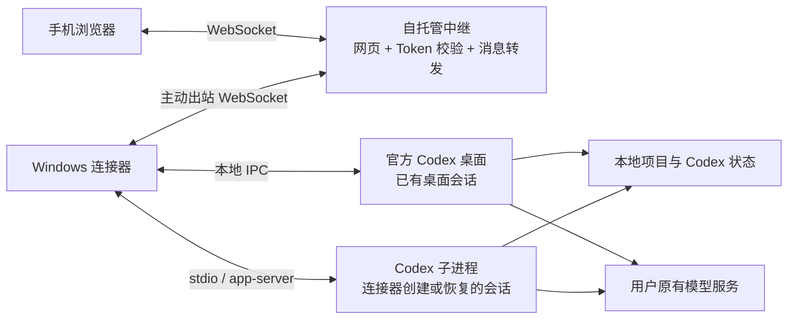

# 开源分享方案

更新：2026-09-17。基于当前源码 `b957210`、本机安装包版本记录，以及使用者“中继版本已运行，测试效果没问题”的反馈。本文整理现有实现与首发准备，不新增产品范围。

## 项目定位

一句话介绍：**通过自己部署的中继，在手机浏览器里继续使用电脑上的 Codex。**

适合已经在 Windows 上使用 Codex、希望离开电脑后查看进度和继续指挥任务的人。手机无需安装 App；电脑继续使用原有项目、模型配置和开发环境。项目按单用户自托管设计。

首次分享暂用现有名称 **Codex Mobile Web**。参考项目中已有名为 Codex Anywhere 的独立项目，直接用相同名称容易让读者误认为本项目是它的分支。介绍中注明“独立第三方项目，与 OpenAI 无隶属关系”，并在 SOURCES 中保留参考来源。

可直接使用的分享文案：

> 我做了一个可以自托管的 Codex 手机网页端。电脑上启动连接器，手机通过自己的中继服务器，就能查看项目和会话、发送任务、补充要求、停止任务，以及回应 Codex 发出的审批和问题。代码执行和模型请求仍在电脑上，手机关掉网页不影响电脑继续运行。目前 Windows + Linux 公网中继已在我自己的环境跑通，准备以早期版本开源。

## 方案结构

公网发布说明以 HTTPS/WSS 为默认接入方式。电脑主动连接中继，无需给家中电脑开放入站端口。

| 部分 | 做什么 | 代码入口 |
| --- | --- | --- |
| 手机 Web | 项目与会话、消息输入、进度、审批、文件和差异预览 | `web/main.tsx`、`web/client.ts` |
| 中继 | 提供网页、校验 Token、发现在线电脑、转发请求和变更通知 | `src/server/relay.ts` |
| 电脑连接器 | 读取本机项目与会话，将操作交给对应运行端 | `src/connector/control.ts` |
| 桌面适配 | 订阅和控制官方桌面已有会话，解析其当前历史结构 | `src/connector/desktop.ts`、`normalize.ts` |
| app-server 适配 | 启动本机 Codex 子进程，管理连接器发起的会话 | `src/connector/app-server.ts` |
| 操作记录 | 保存操作 ID、摘要与回执，处理重连后的结果核实 | `src/connector/ledger.ts` |

技术栈为 TypeScript、React、Node 和 WebSocket；操作记录使用电脑本地 SQLite。中继没有业务数据库。

## 核心设计

**按会话的实际运行端操作。** 已由连接器加载的会话走 app-server；其他会话尝试连接官方桌面的当前运行端。若找不到运行端，展示历史并明确提示，使用者确认原任务结束后才能选择“在这里继续”。不把读取历史当成接管正在运行的独立 CLI 任务。

**手机连接和电脑任务分开。** 关闭手机网页或中继短暂断连不会主动关闭电脑上的 Codex。重启连接器会关闭它启动的 app-server 子进程，可能中断其任务；独立官方桌面不随连接器停止。电脑仍需要开机、联网。

**回执丢失时先核实。** 写操作带独立 ID，电脑保存操作状态；手机重连后查询原结果。无法确认时显示“待核实”，不自动重复发送。该机制避免盲目重放，不承诺跨任意故障的严格 exactly-once。

**沿用本机 Codex。** 模型请求从电脑直接发往已配置的服务，本项目不转售模型、不转换模型协议。已有桌面会话使用桌面设置；连接器会话继承其启动环境和 Codex 默认配置。当前 CLI 基线的命名 profile 不支持用于 app-server，配置时会明确报错。

## 数据与信任边界

| 位置 | 持久保存的内容 |
| --- | --- |
| 手机浏览器 | 当前站点的连接 Token、文字草稿、待核实操作；图片附件只在内存中 |
| 中继服务器 | 部署配置和必要运行日志；程序不把聊天正文、项目文件或会话历史写入业务存储 |
| 电脑连接器 | 连接配置、操作 ID、载荷摘要、结果关联与运行日志 |
| 原生 Codex 与工作区 | 原有模型配置、认证材料、会话状态、代码及文件 |

**中继能读取转发内容，目前没有端到端加密。** 聊天、审批信息、请求预览的文件和差异会经过中继内存。HTTPS 保护网络传输，不会让中继看不到内容。因此分享时应写“中继不持久化聊天历史”，不能写“内容不经过服务器”或“服务器无法读取”。

模型凭据由本机 Codex 管理，连接器不专门上传模型 Key 或配置正文；使用者主动发送或任务输出的敏感文本仍会随内容经过中继。

同一个实例使用共享 Token。持有 Token 的客户端可访问该实例已连接电脑暴露的项目、会话和控制能力，没有逐设备权限隔离。Token 会保存在浏览器本地存储中，二维码也包含 Token，公开截图或演示时不能展示真实连接码。

中继不提供历史备份或任务迁移；电脑离线时，新连接的手机无法从中继取得电脑历史，也无法执行任务。

## 当前验证到哪里

| 项目 | 当前证据与边界 |
| --- | --- |
| 使用反馈 | 使用者已确认中继版本运行成功、测试效果正常；不据此替全部人工用例勾选通过 |
| Windows 连接器 | 本机安装包 `VERSION.txt` 为 0.1.3 / `b957210` / Node 24.11.1 / Windows x64 |
| 公网链路 | 已有任务记录确认 Linux 上独立 Node 24 + systemd 中继启动、健康检查通过、Windows 接入成功；使用者进一步确认实际使用正常 |
| 当前传输 | 实际部署为公网 IP + HTTP/WS；此路径已跑通，但 Token 和转发内容在网络中未加密 |
| 桌面兼容基线 | 代码适配记录为 Codex Desktop 26.901.6511.0；依赖未公开承诺稳定的本地 IPC，不能承诺后续版本自动兼容 |
| CLI 兼容基线 | Codex CLI 0.146.0；已有真实 app-server 配合本地模型夹具的协议验证记录 |
| 自动检查 | 既有实施记录为类型检查、21 项测试和构建通过；本次文档整理未重新运行程序检查 |
| Docker + Caddy HTTPS | 已有构建包、部署文档与配置检查，尚无实际容器运行和证书签发的通过记录 |
| 尚未逐项确认 | 审批、锁屏/换网、全新电脑安装、真实第三方模型；macOS 尚未验收 |

首发可作为 **Windows 优先的早期版本** 分享。主要维护成本是 Codex 桌面 IPC 版本变化；支持说明应绑定已验证版本，升级后由人类执行少量真实操作确认。

当前也不包含后台推送、独立 CLI 活动任务接管、大文件下载或完整远程终端。历史显示上限和其他限制沿用 QUICKSTART，不再扩展首发范围。

## 最小开源交付

单独发布 `codex-mobile-web` 仓库即可，源码已经是独立 Git 仓库。上一级目录中的旧试验项目不并入。当前没有配置 Git remote，也未发现项目自身的 LICENSE 文件。

首发保留现有两类产物：Windows 便携 ZIP（附 Node）和 Linux 中继预构建 tar.gz（附网页及程序），各带版本说明和 SHA256。不需要同时做 npm 发布、原生手机 App、账号平台或集中托管服务；`package.json` 的 `private: true` 不妨碍以源码仓库和下载包分享。

公开首页已整理为 [英文 README](README.md) 和 [中文 README](README.zh-CN.md)，含架构图、安装入口、支持范围和隐私摘要；[双语隐私说明](PRIVACY.md) 对照源码列出数据、权限、保留与撤销方式。QUICKSTART 面向电脑和手机，DEPLOY 面向服务器，SOURCES 说明来源；DESIGN 和 IMPLEMENTATION 保留为维护记录，不要求新用户先阅读。

发布前只收尾四件事：

1. **确定项目名和许可。** 名称可先沿用 Codex Mobile Web；许可可考虑 MIT，但本次不代作者授予许可。选定后添加项目 LICENSE 和 package 元数据，并让两个打包脚本都携带项目许可证。现有脚本已收集依赖许可证，Windows 包另外携带 Node 许可证；仍需核对实际引用和分发内容的归属说明。
2. **把真实部署过程变成可复用说明。** 补齐目前已跑通的 Node + systemd 路径，去掉个人 IP、目录和凭据；公开推荐入口统一为 HTTPS。现有 Docker + Caddy 路径若作为推荐入口，应先由人类完成一次实际部署确认。
3. **收口文档和发布包。** QUICKSTART、ACCEPTANCE 等文件的旧状态已同步，未逐项确认的用例继续保留。发布时将隐私说明随包提供，并从确定提交重新生成两个包，不直接发布正在使用的安装目录。应用实测由人类完成，记录简短结果即可。
4. **检查后公开。** 检查 Git 全历史和最终压缩包，排除 `.local`、Token、私钥、连接二维码及研究副本；再创建公开仓库和首个 Release。附一张脱敏界面图即可，无需为首发制作完整宣传站。

本次只对当前受版本控制文件做了有限模式检查，未发现常见私钥头、所列常见凭据格式、本机用户绝对路径或实际公网 IP；`.local`、`.research`、构建目录及 release 目录未被跟踪。这不是完整密钥审计，不能替代发布前的全历史和最终包检查。

后续优先响应用户实际遇到的兼容和安装问题，再决定是否增加 macOS、推送或端到端加密；这些不作为首发的前置扩建。
