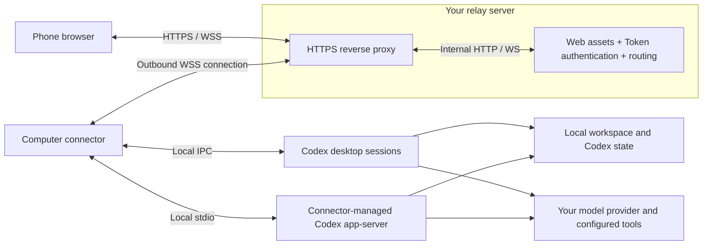

# Codex Mobile Web

English | [简体中文](README.zh-CN.md)

Continue using Codex on your computer from your phone, through a relay you host.

Browse projects and conversations, send instructions, steer or stop a running task, and respond to Codex approvals from a mobile browser. Execution stays on your computer, with its existing workspace, model configuration, and tools. No mobile app or project-operated account service is required.

## Features

- Discover existing projects and conversations, including archived conversations.
- Start or continue tasks, follow progress, add instructions, stop a turn, and answer supported approvals or questions.
- View Markdown, code, task diffs, and small text/image files. Attach images when the runtime confirms model support.
- Reconnect after a browser disconnect, retain text drafts, and check uncertain operations without automatically resending them.

Closing the phone page does not stop Codex. The computer must remain on and connected. The relay is not a backup service and cannot execute tasks or supply stored conversation history while the computer is offline.

## Privacy

- You choose and operate the relay. The bridge has no built-in analytics, advertising, or telemetry endpoint operated by this project.
- The relay application does not persist conversation history or project files, but it can read forwarded content. There is no end-to-end encryption; use a trusted relay with HTTPS/WSS for public access.
- Model requests go from your computer to your configured provider. The bridge does not deliberately upload model credentials, but secrets in messages, tool output, or file previews travel with that content.
- The shared Token grants access to projects and conversations on connected computers, without per-device or per-project permissions. File previews use the connector's OS permissions and can read outside the selected project, subject to preview format and size limits.

See [Privacy details](PRIVACY.md#english) for data storage, Token revocation, and removal.

## Architecture



This shows the recommended public HTTPS deployment. TLS ends at the reverse proxy. The proxy-to-relay connection stays on the same host or private container network; both are trusted components.

The connector uses local desktop IPC for existing desktop sessions, and a Codex app-server child process for sessions it creates or resumes. If a live owner cannot be reached, it shows history and asks you to confirm that the original task has ended before resuming it here. Active standalone CLI sessions cannot be taken over.

The relay keeps connection routes in memory; the connector stores operation IDs and receipts in local SQLite. After reconnecting, the browser fetches current state and checks earlier operations. Uncertain results remain pending rather than triggering an automatic retry. Restarting the connector may interrupt its own app-server tasks; its stop script does not stop the separate Codex desktop process.

Implementation: [web/](web/), [relay.ts](src/server/relay.ts), [control.ts](src/connector/control.ts), [desktop.ts](src/connector/desktop.ts), and [ledger.ts](src/connector/ledger.ts). More detail is in [DESIGN.md](DESIGN.md) (Chinese).

## Getting started

You need Windows with working Codex, a phone browser, and a relay reachable by both. Keep Codex desktop running under the same OS user as the connector to control existing desktop sessions.

### Windows connector

Download the Windows ZIP from [Releases](https://github.com/hzx829/codex-mobile-web/releases), extract it and run `start.cmd`. Node and the built application are included; Codex must already be installed separately.

From a source checkout, install Node 24 and run in the repository directory:

```powershell
npm ci
npm run build
.\start.cmd
```

The first launch opens setup. For a local trial, select “本机中继” (local relay), join the same trusted Wi-Fi on your phone, and scan the QR code. Local mode uses unencrypted HTTP. For public use, deploy the HTTPS relay below, then select “连接自己的中继” (your own relay), enter its HTTPS URL and shared Token, and start the connector. Projects are discovered automatically.

### Public relay

On Linux with Docker Engine and Compose v2, use a source checkout or an extracted relay package from [Releases](https://github.com/hzx829/codex-mobile-web/releases). Point a domain at the server and allow TCP 80/443. In that directory:

```sh
cp .env.example .env
chmod 600 .env
openssl rand -hex 32
```

Edit `.env`: set `DOMAIN` to your hostname without `https://`, and `BRIDGE_TOKEN` to the generated value. Then run:

```sh
docker compose -f compose.yaml -f compose.https.yaml config --quiet
docker compose -f compose.yaml -f compose.https.yaml up -d --build
curl --fail https://your-domain.example/health
```

Replace `your-domain.example` with your hostname. The supplied Caddy configuration provides HTTPS; port 3340 is published only on server loopback. The computer connects outbound, so no router port forwarding to it is needed. Source builds download npm dependencies; prebuilt relay packages only need the base container images.

See [DEPLOY.md](DEPLOY.md) (Chinese) for existing proxies, upgrades, rollback, and troubleshooting.

### Connect and manage

Scan the connector's QR code or open your relay URL and enter the same Token. The browser remembers it for that site. Treat the QR code like a password. Once connected, select a project, open a conversation, or start a new task.

Use `configure.cmd` to change settings after stopping this installation. `stop.cmd` stops the connector and its Codex child process, so finish connector-managed tasks first. Setup, optional login startup, and uninstall instructions are in [QUICKSTART.md](QUICKSTART.md) (Chinese).

## Compatibility and limits

| Component | Version |
| --- | --- |
| Computer | Windows x64; portable package includes Node 24.11.1 |
| Codex CLI | 0.146.0 |
| Codex desktop | 26.901.6511.0 IPC adaptation; desktop upgrades may require changes |

Models use your existing local Codex configuration. The connector is currently available for Windows; macOS and Linux connectors are not supported.

Current limits: latest 100 turns per conversation view, truncated large output, file previews up to 2 MiB, and at most two supported images of 2 MiB each. No background push, audio upload, large-file download, or active standalone CLI takeover. Named Codex profiles are rejected for connector-managed app-server sessions on the tested CLI baseline.

## Development and provenance

```sh
npm run check
npm run build
npm run package:windows  # run on Windows
npm run package:relay
```

Packages go to `release/`; local configuration and operation records go to `.local/`. Both are excluded by `.gitignore`.

Independently implemented in TypeScript, with architectural research from **Codex Anywhere** and **Remodex**. Fixed references and attribution are in [SOURCES.md](SOURCES.md). Their pairing and encryption implementations are not included.

Licensed under [MIT](LICENSE). Packages include third-party dependency licenses and, on Windows, the bundled Node license.
