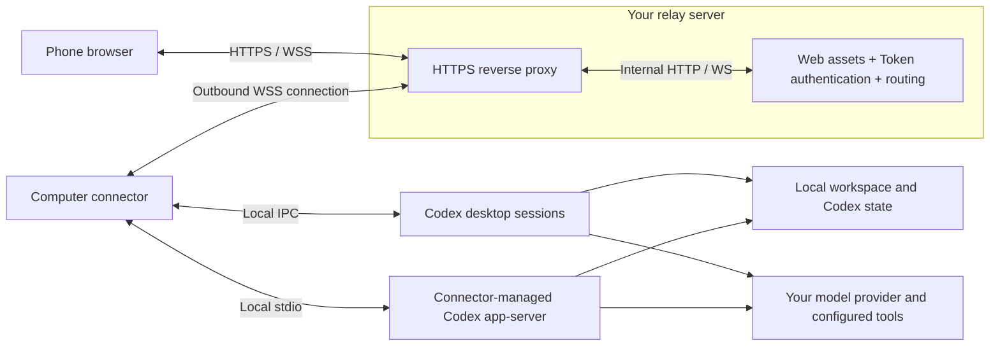

# Codex Mobile Web

English | [简体中文](README.zh-CN.md)

Continue using Codex on your computer from your phone, through a relay you host.

Browse projects and conversations, send instructions, steer or stop a running task, and respond to Codex approvals from a mobile browser. Execution stays on your computer, with its existing workspace, model configuration, and tools. No mobile app or project-operated account service is required.

## Features

- Discover existing projects and conversations, including archived conversations.
- Start or continue tasks, follow progress, add instructions, stop a turn, and answer supported approvals or questions.
- Consecutive tool activity is collapsed in the timeline.
- Tap a suggested follow-up to fill the composer; in-app back buttons return to the parent list.
- Long-press a conversation on mobile or right-click on desktop to pin, organize, mark unread, copy its ID, rename or archive it. Pins, sections and unread marks stay in this browser per computer; rename and archive update Codex.
- Choose the next turn's model, reasoning effort and approval policy inside the composer.
- Open the top-right status ring to see the thread ID, directory, context usage, account limits and reset times. Missing native statistics are shown as unavailable.
- Preview Markdown, highlighted code, visual task diffs, images and videos in a bottom sheet on phones or a right pane on desktop. Download other files such as PowerPoint, PDF and ZIP. Select or paste images, including image Base64, with a count and clickable previews before sending. Image attachments require runtime-confirmed model support.
- Open a local web page through the relay; the phone renders it directly while the connector forwards requests to the project's `localhost`.
- Reconnect after a browser disconnect, retain text drafts, and check uncertain operations without automatically resending them.

Closing the phone page does not stop Codex. The computer must remain on and connected. The relay is not a backup service and cannot execute tasks or supply stored conversation history while the computer is offline.

## Privacy

- You choose and operate the relay. The bridge has no built-in analytics, advertising, or telemetry endpoint operated by this project.
- The relay application does not persist conversation history or project files, but it can read forwarded content. There is no end-to-end encryption; use a trusted relay with HTTPS/WSS for public access.
- Model requests go from your computer to your configured provider. The bridge does not deliberately upload model credentials, but secrets in messages, tool output, or file previews travel with that content.
- The shared Token grants access to projects and conversations on connected computers, without per-device or per-project permissions. File previews and downloads use the connector's OS permissions and can read outside the selected project, subject to their respective size limits.

See [Privacy details](PRIVACY.md#english) for data storage, Token revocation, and removal.

## Architecture


```mermaid
flowchart LR
    Phone["Phone browser"] <-->|"HTTPS / WSS"| Proxy
    subgraph Server["Your relay server"]
        Proxy["HTTPS reverse proxy"] <-->|"Internal HTTP / WS"| Relay["Web assets + Token authentication + routing"]
    end
    Connector["Computer connector"] <-->|"Outbound WSS connection"| Proxy
    Connector <-->|"Local IPC"| Desktop["Codex desktop sessions"]
    Connector <-->|"Local stdio"| Runtime["Connector-managed Codex app-server"]
    Desktop --> Local["Local workspace and Codex state"]
    Runtime --> Local
    Desktop --> Provider["Your model provider and configured tools"]
    Runtime --> Provider
```

This shows the recommended public HTTPS deployment. TLS ends at the reverse proxy. The proxy-to-relay connection stays on the same host or private container network; both are trusted components.

The connector uses local desktop IPC for existing desktop sessions, and a Codex app-server child process for sessions it creates or resumes. If a live owner cannot be reached, it shows history and asks you to confirm that the original task has ended before resuming it here. Active standalone CLI sessions cannot be taken over.

On Windows, an unset `codexBin` uses the newest Codex in the desktop installation before checking PATH. Restart the connector after a desktop update when its tasks are idle. An explicit binary path remains pinned until changed.

The relay keeps connection routes in memory; the connector stores operation IDs and receipts in local SQLite. After reconnecting, the browser fetches current state and checks earlier operations. Uncertain results remain pending rather than triggering an automatic retry. Restarting the connector may interrupt its own app-server tasks; its stop script does not stop the separate Codex desktop process.

Implementation: [web/](web/), [relay.ts](src/server/relay.ts), [control.ts](src/connector/control.ts), [desktop.ts](src/connector/desktop.ts), and [ledger.ts](src/connector/ledger.ts). More detail is in [DESIGN.md](DESIGN.md) (Chinese).

## Getting started

You need Windows with working Codex, a phone browser, and a relay reachable by both. Keep Codex desktop running under the same OS user as the connector to control existing desktop sessions.

### Windows connector

To let Codex on another computer handle installation, ask it to install `skills/codex-mobile-web-setup` from the GitHub repository `hzx829/codex-mobile-web`. On the next turn, use `$codex-mobile-web-setup` with your existing relay URL. The skill downloads and verifies the portable release, detects local Codex, starts the connector, and checks the connection without creating a task. Enter the Token once in a local masked dialog, or provide a local Token file. GitHub sign-in does not transfer relay credentials. See [the setup skill](skills/codex-mobile-web-setup/SKILL.md).

Download the Windows ZIP from [Releases](https://github.com/hzx829/codex-mobile-web/releases), extract it and run `start.cmd`. Node and the built application are included; Codex must already be installed separately.

From a source checkout, install Node 24 and run in the repository directory:

```powershell
npm ci
npm run build
.\start.cmd
```

The first launch opens setup. For a local trial, select “本机中继” (local relay), join the same trusted Wi-Fi on your phone, and scan the QR code. Local mode uses unencrypted HTTP. For public use, deploy the HTTPS relay below, then select “连接自己的中继” (your own relay), enter its HTTPS URL and shared Token, and start the connector. Projects are discovered automatically.

### Public relay

On Linux with Docker Engine and Compose v2, use a source checkout or an extracted relay package from [Releases](https://github.com/hzx829/codex-mobile-web/releases). Point a domain at the server and allow TCP 80/443/3341. In that directory:

```sh
cp .env.example .env
chmod 600 .env
openssl rand -hex 32
```

Edit `.env`: set `DOMAIN` to your hostname without `https://`, and `BRIDGE_TOKEN` to the generated value. Then run:

```sh
docker compose -f compose.yaml -f compose.https.yaml config --quiet
docker compose -f compose.yaml -f compose.https.yaml up -d --build
curl --fail https://your-domain.example/health
```

Replace `your-domain.example` with your hostname. The supplied Caddy configuration provides HTTPS for the main site and preview port 3341; relay ports 3340/3341 are published only on server loopback. The computer connects outbound, so no router port forwarding to it is needed. Source builds download npm dependencies; prebuilt relay packages only need the base container images.

See [DEPLOY.md](DEPLOY.md) (Chinese) for existing proxies, upgrades, rollback, and troubleshooting.

### Connect and manage

Scan the connector's QR code or open your relay URL and enter the same Token. The browser remembers it for that site. Treat the QR code like a password. Once connected, select a project, open a conversation, or start a new task.

To preview a web app, start its development server on the computer. Open an existing conversation, choose “打开本机网页” from the composer’s “＋” menu and enter a local URL such as `http://127.0.0.1:5173`. The address is saved per computer and thread. The page opens in the preview pane, with a separate-tab option for sites that block embedding. Closing the pane keeps the preview session; “结束预览” or switching threads/computers ends it. Returning to a thread lets you reopen its saved address. Each connector supports one active preview. The relay and connector tunnel HTTP and WebSocket requests instead of streaming screenshots. The preview port is the relay port plus one (3341 by default). Projects with hard-coded `localhost` URLs or Host/Origin restrictions may need changes.

Use `configure.cmd` to change settings after stopping this installation. `stop.cmd` stops the connector and its Codex child process, so finish connector-managed tasks first. Setup, optional login startup, and uninstall instructions are in [QUICKSTART.md](QUICKSTART.md) (Chinese).

## Compatibility and limits

| Component | Version |
| --- | --- |
| Computer | Windows x64; portable package includes Node 24.11.1 |
| Codex CLI | 0.146.0 |
| Codex desktop | 26.901.6511.0 IPC adaptation; desktop upgrades may require changes |

Models use your existing local Codex configuration. The connector is currently available for Windows; macOS and Linux connectors are not supported.

Click a file link in a reply, choose “下载文件” (download), then “保存到设备” (save to device) after receiving it. You can also enter a path in the conversation menu's “查看项目文件” option. Files transfer on demand from the selected computer without a relay copy; the computer must stay online. Downloads up to 100 MiB show progress and can be cancelled. File changes or disconnections fail explicitly; reopen the file to retry. Closing the file panel cancels reception and releases temporary content. Update both the relay web application and the computer connector to enable this feature.

Task diffs support file selection, syntax and inline-edit highlighting, unified and side-by-side views. Markdown files support relative file links and local images. PowerPoint, PDF and other complex formats currently have a download entry only. Update the web application, relay and connector together. Preview UI acceptance remains manual; see [acceptance steps](ACCEPTANCE.md).

Current limits: latest 100 turns per conversation view, truncated large output, text/image previews up to 2 MiB, file downloads and video playback up to 100 MiB, and at most two supported image attachments of 2 MiB each. MP4, WebM, OGV and MOV load on request into browser memory and use the browser's native decoder. Code views show up to 10,000 lines. Downloads are assembled in browser memory without resumable transfers. No background push, audio upload, or active standalone CLI takeover. Named Codex profiles are rejected for connector-managed app-server sessions on the tested CLI baseline.

## Development and provenance

```sh
npm run check
npm run build
npm run package:windows  # run on Windows
npm run package:relay
```

Packages go to `release/`; local configuration and operation records go to `.local/`. Both are excluded by `.gitignore`.

Independently implemented in TypeScript, with architectural research from **Codex Anywhere** and **Remodex**. Fixed references and attribution are in [SOURCES.md](SOURCES.md). Their pairing and encryption implementations are not included.

Licensed under [MIT](LICENSE). Packages include third-party dependency licenses and, on Windows, the bundled Node license.
