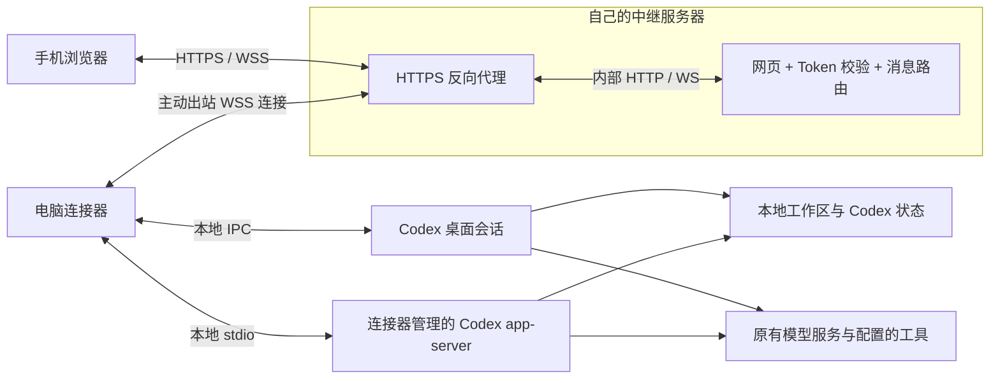

# Codex Mobile Web

[English](README.md) | 简体中文

通过自己部署的中继，在手机浏览器里继续使用电脑上的 Codex。

查看项目和会话、发送任务、补充要求、停止任务，以及回应 Codex 的审批和问题。任务仍在电脑上执行，沿用原有工作区、模型配置和工具。手机无需安装 App，也无需注册项目方账号。

## 可以做什么

- 自动发现已有项目和会话，包括归档会话。
- 新建或继续任务，查看进度、补充要求、停止任务，以及回应支持的审批和问题。
- 查看 Markdown、代码、任务差异和小型文本/图片文件；运行端确认模型支持图片时可以附图输入。
- 浏览器断线后重连、保留文字草稿，核实结果不明的操作而不自动重复发送。

关闭手机网页不会停止 Codex。电脑需要保持开机和联网。中继不提供备份，电脑离线时无法替电脑执行任务，也无法提供已存储的会话历史。

## 隐私

- 中继由你选择并部署。项目没有内置统计、广告或向项目方发送遥测的端点。
- 中继程序不持久化聊天历史或项目文件，但能够读取转发内容。目前没有端到端加密；公网访问应使用可信中继及 HTTPS/WSS。
- 模型请求由电脑发往已配置的模型服务。连接器不专门上传模型凭据，但消息、工具输出或文件预览中的敏感信息会随内容转发。
- 共享 Token 可访问已连接电脑的项目和会话，没有逐设备或逐项目权限隔离。文件预览沿用连接器所在系统账户的权限，可以读取所选项目之外的文件，受预览格式和大小限制。

数据保存、Token 撤销和清理方法见 [隐私说明](PRIVACY.md#简体中文)。

## 架构



图中为推荐的公网 HTTPS 部署。TLS 在反向代理处终止，代理到中继的连接应留在同一主机或私有容器网络；两者均属于需要信任的部分。

连接器通过本地桌面 IPC 操作已有桌面会话，通过 Codex app-server 子进程管理自己新建或恢复的会话。找不到实时运行端时，只展示历史，使用者确认原任务结束后才能选择“在这里继续”。目前不接管独立 CLI 中正在运行的任务。

中继只在内存维护连接路由，连接器在本地 SQLite 保存操作 ID 和回执。重连后，手机获取当前状态并查询原操作；结果不明时保持“待核实”，不自动重发。重启连接器可能中断它自己管理的 app-server 任务；停止脚本不会关闭独立的 Codex 桌面进程。

主要实现：[web/](web/)、[relay.ts](src/server/relay.ts)、[control.ts](src/connector/control.ts)、[desktop.ts](src/connector/desktop.ts)、[ledger.ts](src/connector/ledger.ts)。更多细节见 [设计说明](DESIGN.md)。

## 开始使用

需要一台已经能正常使用 Codex 的 Windows 电脑、手机浏览器，以及双方都能访问的中继。操作已有桌面会话时，Codex 桌面需保持运行，并与连接器使用相同的系统账户。

### Windows 连接器

从 [Releases](https://github.com/hzx829/codex-mobile-web/releases) 下载 Windows 便携 ZIP，解压后双击 `start.cmd`。包内附带 Node 和构建结果，Codex 需事先单独安装。

从源码启动时，安装 Node 24，在仓库目录执行：

```powershell
npm ci
npm run build
.\start.cmd
```

首次启动会打开配置窗口。本地试用可选择“本机中继”，手机连接同一可信 Wi-Fi 后扫码；本机模式使用 HTTP，传输不加密。公网使用时，先按下文部署 HTTPS 中继，再选择“连接自己的中继”，填写 HTTPS 地址和共享 Token，启动连接器。项目会自动发现。

### 公网中继

Linux 服务器需有 Docker Engine 和 Compose v2。使用源码目录，或从 [Releases](https://github.com/hzx829/codex-mobile-web/releases) 下载并解压中继包，将域名解析到服务器，确保 TCP 80/443 可访问。在该目录执行：

```sh
cp .env.example .env
chmod 600 .env
openssl rand -hex 32
```

编辑 `.env`：`DOMAIN` 填不带 `https://` 的域名，`BRIDGE_TOKEN` 填刚生成的随机值。随后执行：

```sh
docker compose -f compose.yaml -f compose.https.yaml config --quiet
docker compose -f compose.yaml -f compose.https.yaml up -d --build
curl --fail https://your-domain.example/health
```

将 `your-domain.example` 替换为自己的域名。附带的 Caddy 配置提供 HTTPS；3340 只发布到服务器回环地址。电脑主动连接中继，无需为家中电脑配置路由器端口映射。源码部署会下载 npm 依赖，预构建中继包只需拉取基础镜像。

已有代理、升级、回退和排错见 [公网部署](DEPLOY.md)。

### 连接与管理

扫描连接器二维码，或打开中继地址、输入同一个 Token。浏览器会为该站点记住 Token；二维码应像密码一样保管。连接后即可选择项目、打开会话或创建新任务。

停止本安装后，用 `configure.cmd` 修改配置。`stop.cmd` 会停止连接器和它的 Codex 子进程，应先完成连接器管理的任务。详细启动、可选登录自启及卸载方法见 [QUICKSTART.md](QUICKSTART.md)。

## 兼容与限制

| 组件 | 版本 |
| --- | --- |
| 电脑 | Windows x64；便携包内置 Node 24.11.1 |
| Codex CLI | 0.146.0 |
| Codex 桌面 | 按 26.901.6511.0 适配 IPC；桌面升级可能需要同步修改 |

模型沿用本机 Codex 配置。目前提供 Windows 连接器，macOS 和 Linux 连接器暂不在支持范围内。

当前会话视图最多显示最近 100 轮，大输出会截断；文件预览上限为 2 MiB，支持的图片输入最多两张、每张 2 MiB。暂不支持后台推送、音频上传、大文件下载或独立 CLI 活动任务接管。当前 CLI 基线下，连接器管理的 app-server 不支持命名 profile，设置后会明确报错。

## 开发与来源

```sh
npm run check
npm run build
npm run package:windows  # 在 Windows 上执行
npm run package:relay
```

发布包输出到 `release/`，本地配置与操作记录保存在 `.local/`；两者均已加入 `.gitignore`。

项目使用 TypeScript 独立实现，设计研究参考了 **Codex Anywhere** 与 **Remodex**。固定版本和来源说明见 [SOURCES.md](SOURCES.md)。本项目未引入它们的设备配对和加密实现。

项目许可证待定。发布包附带第三方依赖许可证，Windows 包另附 Node 许可证。
